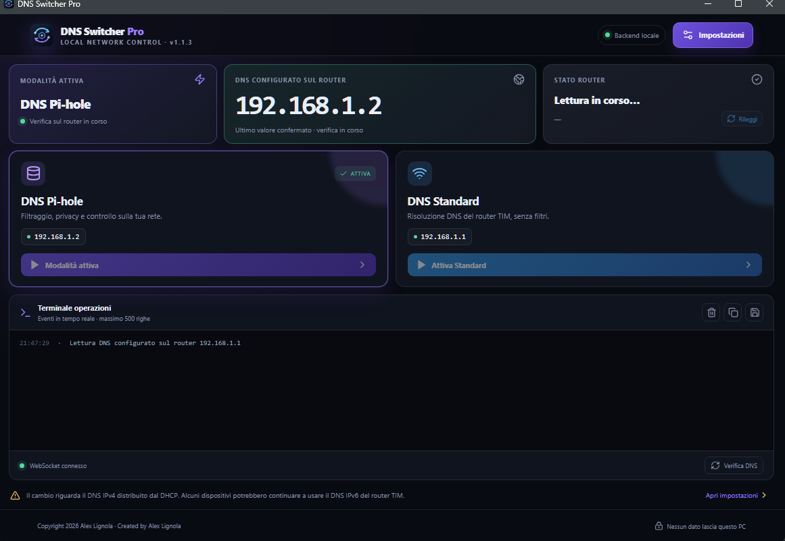
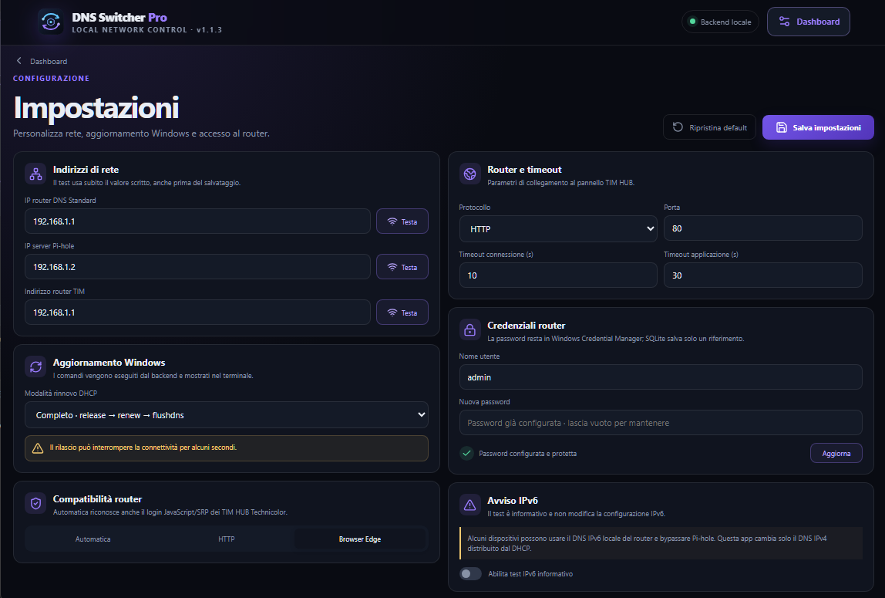

# DNS Switcher Pro


DNS Switcher Pro è una dashboard per alternare il DNS IPv4 distribuito dal TIM
HUB tra un server Pi-hole e il DNS standard del router. È disponibile in due
modalità:

- **applicazione Windows portabile**, tramite `DNSSwitcherPro.exe`;
- **container Docker sempre attivo**, utilizzabile su ZimaOS o su qualsiasi
  server Linux/NAS capace di eseguire Docker Compose.

Il container può funzionare sullo stesso server che ospita Pi-hole oppure
collegarsi a un Pi-hole presente su un altro dispositivo della LAN. Pi-hole non
è incluso nell'immagine: deve essere già installato e raggiungibile sulla porta
DNS 53.

Entrambe le versioni usano lo stesso backend Python/FastAPI e la stessa webapp
React + TypeScript. Su Windows l'interfaccia viene ospitata in Microsoft Edge
WebView2; nel container è accessibile dal browser della rete locale.

## Anteprima





## Caratteristiche

- Due pulsanti grandi per attivare DNS Pi-hole o DNS Standard.
- Lettura automatica del DNS realmente configurato sul router.
- Login al router TIM con sessione HTTP persistente e fallback Playwright.
- Edge nella versione Windows e Chromium headless nella versione Docker.
- Rinnovo DHCP e svuotamento cache DNS nella versione Windows.
- Verifica con `nslookup google.com. <DNS_ATTIVO>`.
- Terminale integrato con eventi WebSocket, copia e salvataggio del log.
- Impostazioni IPv4, protocollo/porta, timeout, compatibilità router e tema.
- Credenziali in Windows Credential Manager oppure cifrate nel volume Docker.
- Database e log in `Codex_Work/` su Windows o nel volume persistente Docker.
- Accesso Docker protetto da token e dati persistenti separati dall'immagine.

## Requisiti

### Applicazione Windows

- Windows 10/11, preferibilmente Windows 11.
- Microsoft Edge WebView2 Runtime.
- TIM HUB e Pi-hole raggiungibili dalla rete locale.

### Container server

- ZimaOS, Linux, NAS o altro server con Docker e Docker Compose.
- Architettura `amd64` per il pacchetto ZimaOS fornito.
- Porta TCP 8765 disponibile per la dashboard.
- TIM HUB e Pi-hole raggiungibili dal container sulla LAN.
- Almeno 2 GB liberi durante la prima build, che installa Chromium Playwright.

Python 3.12+, Node.js LTS e npm sono richiesti soltanto per lo sviluppo o la
compilazione manuale; la build Docker installa autonomamente le dipendenze.

## Installazione e sviluppo

```powershell
py -3.12 -m venv Codex_Work\venv
Codex_Work\venv\Scripts\Activate.ps1
python -m pip install -r backend\requirements.txt
cd frontend
npm install
npm run build
cd ..
```

Avvio backend in sviluppo:

```powershell
$env:DNS_SWITCHER_DEV="1"
python -m backend.run_server --port 8765 --token development-only-token
```

In un secondo terminale, `cd frontend; npm run dev` permette il lavoro con Vite.
L'URL del frontend deve includere `?token=development-only-token`.

## Primo avvio

Aprire Impostazioni e confermare gli indirizzi del proprio impianto. I valori
predefiniti di esempio sono `192.168.1.1` per router/DNS standard e `192.168.1.2`
per Pi-hole: sostituirli se la rete usa indirizzi diversi. Salvare username e
password; la password non viene mai stampata, serializzata in chiaro o inserita
nel repository.

Il pulsante Pi-hole verifica prima la porta 53, aggiorna il campo **Server DNS**
del router, applica la configurazione, rinnova DHCP, esegue `flushdns` e verifica
il resolver. Il pulsante Standard segue lo stesso flusso senza il controllo Pi-hole.
Nella versione Windows la modalità completa esegue anche `ipconfig /release` e
può interrompere la rete per alcuni secondi. Il container modifica direttamente
il router e non può rinnovare il lease degli altri dispositivi: questi riceveranno
il nuovo DNS al successivo rinnovo DHCP.

### DNS IPv6 TIM

Il router può continuare ad annunciare un DNS IPv6 locale (`fe80::...`). Alcuni
dispositivi possono quindi bypassare Pi-hole. DNS Switcher Pro modifica soltanto
il DNS IPv4 distribuito dal DHCP e non cambia impostazioni IPv6.

## Architettura

```text
backend/app/        FastAPI, SQLite, router client, sicurezza, comandi Windows
frontend/src/       React + TypeScript + Vite, dashboard e impostazioni
desktop/            launcher pywebview e server locale su 127.0.0.1
Docker/             immagine Linux, Compose ZimaOS, installazione e persistenza
Codex_Work/         dati, log e temporanei locali (esclusi da Git)
```

Il backend espone REST `/api/*` e WebSocket `/ws/terminal`; il frontend non
accede direttamente a SQLite, credenziali o comandi di sistema.

## Test

```powershell
python -m pytest -q
```

I test di rete devono usare mock e non contattano router reali.

## Packaging Windows

```powershell
python GeneraExe.py
```

Lo script controlla Windows/Python/Node, compila Vite, esegue i test essenziali,
usa `DNSSwitcherPro.spec` e produce la cartella portabile e il relativo ZIP:

```text
dist/DNSSwitcherPro/DNSSwitcherPro.exe
dist/DNSSwitcherPro-Portable-1.1.3.zip
```

La cartella portabile non include `Codex_Work`, `.env`, database, log o credenziali.
Estrarre `dist/DNSSwitcherPro-Portable-1.1.3.zip` e avviare
`DNSSwitcherPro/DNSSwitcherPro.exe` senza separarlo dalla cartella `_internal`.

## Container Docker per ZimaOS e server Linux

La variante server non richiede che un PC Windows rimanga acceso. È disponibile
nella cartella [`Docker`](Docker/README.md) e comprende:

- Dockerfile multi-stage;
- Compose con metadati `x-casaos` per ZimaOS;
- Chromium Playwright per automatizzare il pannello TIM HUB;
- volume persistente per database, log e credenziali cifrate;
- token per proteggere l'accesso dalla LAN;
- icona e script di installazione guidata.

Installazione diretta da GitHub nel terminale ZimaOS:

```sh
curl -fsSL https://raw.githubusercontent.com/AngoloInformatico/DNS-SwitcherPro/main/Docker/install-from-github.sh | sh
```

Questo comando scarica o aggiorna automaticamente il repository, genera il
token e avvia la build. Non è necessario copiare manualmente i file.

Installazione da una copia locale già presente su ZimaOS:

```sh
cd /DATA/AppData/dns-switcher-pro-source
sh Docker/install-zimaos.sh
```

Lo script genera un token casuale, costruisce l'immagine e mostra l'indirizzo da
aprire, normalmente:

```text
http://IP-DEL-SERVER:8765/?token=TOKEN_GENERATO
```

La stessa configurazione può essere usata su qualunque server Linux o NAS in
grado di eseguire Docker Compose. Il percorso persistente predefinito per
ZimaOS è:

```text
/DATA/AppData/dns-switcher-pro
```

Per installazione, aggiornamenti, log e gestione del token consultare la
[`guida Docker completa`](Docker/README.md).

## Troubleshooting

- **Backend non raggiungibile:** verificare porta locale e token di sviluppo.
- **Router non raggiungibile:** controllare protocollo, porta e IP in Impostazioni.
- **Login fallito:** aggiornare le credenziali; non inserirle nei log o in issue.
- **Pi-hole non risponde:** controllare che il servizio ascolti su TCP/UDP 53.
- **DNS non cambia subito:** attendere il rinnovo DHCP; alcuni client mantengono il lease.
- **WebView2 mancante:** installare il Microsoft Edge WebView2 Runtime.

## Sicurezza

La versione Windows ascolta solo su `127.0.0.1` e usa un token di sessione
temporaneo. La versione Docker espone la dashboard sulla LAN e richiede il token
generato durante l'installazione; non deve essere pubblicata direttamente su
Internet. Nel container la password del router viene cifrata nel volume
persistente. Cookie, token e password non entrano nello storico e i log filtrano
i segreti noti. Non usare questa app per modificare firewall, port forwarding o
IPv6.

## Licenza

Questo progetto è distribuito secondo i termini della GNU General Public License v3.0. Consultare il file LICENSE per il testo completo della licenza.

Copyright 2026 Alex Lignola  
Created by Alex Lignola
