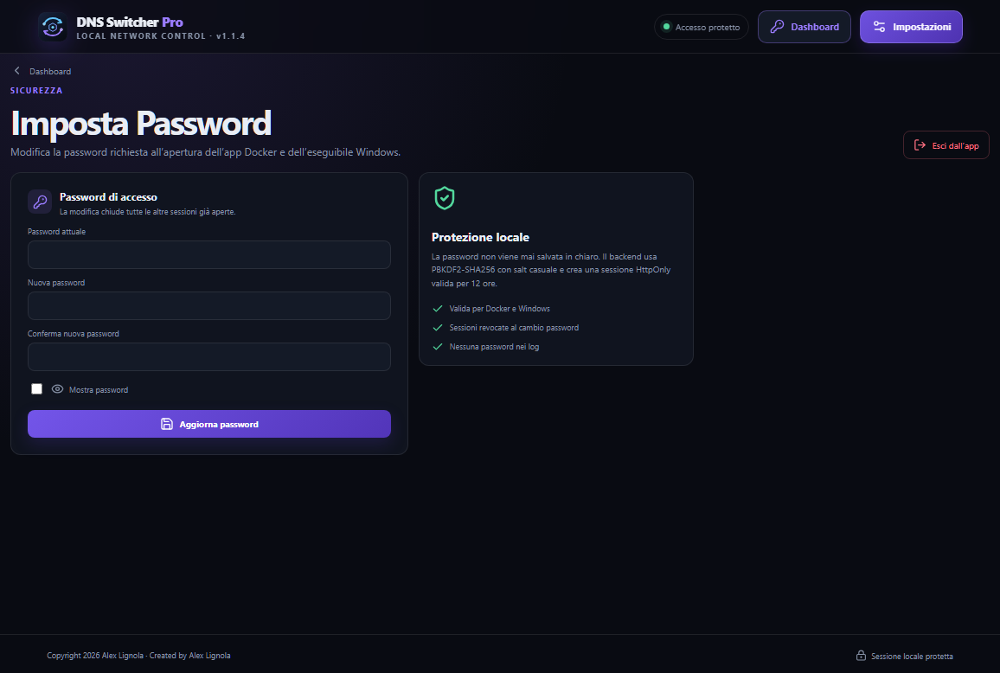

# DNS Switcher Pro


DNS Switcher Pro è una dashboard per alternare il DNS IPv4 distribuito dal TIM
HUB tra un server Pi-hole e il DNS standard del router. È disponibile in due
modalità:

- **applicazione Windows portabile**, tramite `DNSSwitcherPro.exe`;
- **container Docker sempre attivo**, utilizzabile su ZimaOS o su qualsiasi
  server Linux/NAS capace di eseguire Docker Compose.

Il container può funzionare sullo stesso server che ospita Pi-hole oppure
collegarsi a un Pi-hole presente su un altro dispositivo della LAN. Pi-hole non
è incluso nell'immagine: deve essere già installato e raggiungibile sulla porta
DNS 53.

Entrambe le versioni usano lo stesso backend Python/FastAPI e la stessa webapp
React + TypeScript. Su Windows l'interfaccia viene ospitata in Microsoft Edge
WebView2; nel container è accessibile dal browser della rete locale.

## Anteprima




## Novità della versione 1.1.4

- Nuova schermata di primo accesso per creare la password dell'applicazione.
- Login obbligatorio per dashboard, API operative e terminale WebSocket.
- Nuova pagina **Imposta Password**, accessibile dal pulsante accanto a
  **Impostazioni**, con cambio password e comando di logout.
- Password di accesso memorizzata esclusivamente come hash PBKDF2-SHA256 con
  salt casuale; nessuna password in chiaro nel database o nei log.
- Sessione locale tramite cookie HttpOnly con durata di 12 ore; il cambio
  password revoca automaticamente le altre sessioni aperte.
- Protezione disponibile sia nell'eseguibile Windows sia nel container Docker.
- `GeneraExe.py` rileva un interprete Python privo delle dipendenze di build e
  si riavvia automaticamente con Python 3.13 o 3.12 già configurato.
- Nuovo script di disinstallazione per Docker/ZimaOS, con conservazione dei
  dati predefinita e rimozione completa solo tramite `--purge`.

## Caratteristiche

- Due pulsanti grandi per attivare DNS Pi-hole o DNS Standard.
- Lettura automatica del DNS realmente configurato sul router.
- Login al router TIM con sessione HTTP persistente e fallback Playwright.
- Edge nella versione Windows e Chromium headless nella versione Docker.
- Rinnovo DHCP e svuotamento cache DNS nella versione Windows.
- Verifica con `nslookup google.com. <DNS_ATTIVO>`.
- Terminale integrato con eventi WebSocket, copia e salvataggio del log.
- Impostazioni IPv4, protocollo/porta, timeout, compatibilità router e tema.
- Credenziali in Windows Credential Manager oppure cifrate nel volume Docker.
- Database e log in `Codex_Work/` su Windows o nel volume persistente Docker.
- Pagina di login con password locale per le versioni Windows e Docker.
- Cambio password dalla pagina **Imposta Password** e sessioni HttpOnly.
- Logout esplicito e revoca delle altre sessioni dopo il cambio password.
- Script GitHub per la disinstallazione sicura del container Docker/ZimaOS.

## Requisiti

### Applicazione Windows

- Windows 10/11, preferibilmente Windows 11.
- Microsoft Edge WebView2 Runtime.
- TIM HUB e Pi-hole raggiungibili dalla rete locale.

### Container server

- ZimaOS, Linux, NAS o altro server con Docker e Docker Compose.
- Architettura `amd64` per il pacchetto ZimaOS fornito.
- Porta TCP 8765 disponibile per la dashboard.
- TIM HUB e Pi-hole raggiungibili dal container sulla LAN.
- Almeno 2 GB liberi durante la prima build, che installa Chromium Playwright.

Python 3.12+, Node.js LTS e npm sono richiesti soltanto per lo sviluppo o la
compilazione manuale; la build Docker installa autonomamente le dipendenze.

## Installazione e sviluppo

```powershell
py -3.12 -m venv Codex_Work\venv
Codex_Work\venv\Scripts\Activate.ps1
python -m pip install -r backend\requirements.txt
cd frontend
npm install
npm run build
cd ..
```

Avvio backend in sviluppo:

```powershell
$env:DNS_SWITCHER_DEV="1"
python -m backend.run_server --port 8765 --token development-only-token
```

In un secondo terminale, `cd frontend; npm run dev` permette il lavoro con Vite.
L'URL del frontend deve includere `?token=development-only-token`.

## Primo avvio

Al primo avvio viene mostrata la pagina **Crea la password**. Scegliere una
password di almeno 8 caratteri: ogni installazione Windows o Docker conserva
la propria password locale. Agli avvii successivi verrà mostrata la pagina di
login. La password può essere cambiata con **Imposta Password**, accanto al
pulsante Impostazioni.

Aprire quindi Impostazioni e confermare gli indirizzi del proprio impianto. I valori
predefiniti di esempio sono `192.168.1.1` per router/DNS standard e `192.168.1.2`
per Pi-hole: sostituirli se la rete usa indirizzi diversi. Salvare username e
password; la password non viene mai stampata, serializzata in chiaro o inserita
nel repository.

Il pulsante Pi-hole verifica prima la porta 53, aggiorna il campo **Server DNS**
del router, applica la configurazione, rinnova DHCP, esegue `flushdns` e verifica
il resolver. Il pulsante Standard segue lo stesso flusso senza il controllo Pi-hole.
Nella versione Windows la modalità completa esegue anche `ipconfig /release` e
può interrompere la rete per alcuni secondi. Il container modifica direttamente
il router e non può rinnovare il lease degli altri dispositivi: questi riceveranno
il nuovo DNS al successivo rinnovo DHCP.

### DNS IPv6 TIM

Il router può continuare ad annunciare un DNS IPv6 locale (`fe80::...`). Alcuni
dispositivi possono quindi bypassare Pi-hole. DNS Switcher Pro modifica soltanto
il DNS IPv4 distribuito dal DHCP e non cambia impostazioni IPv6.

## Architettura

```text
backend/app/        FastAPI, SQLite, router client, sicurezza, comandi Windows
frontend/src/       React + TypeScript + Vite, dashboard e impostazioni
desktop/            launcher pywebview e server locale su 127.0.0.1
Docker/             immagine Linux, Compose ZimaOS, installazione e persistenza
Codex_Work/         dati, log e temporanei locali (esclusi da Git)
```

Il backend espone REST `/api/*` e WebSocket `/ws/terminal`; il frontend non
accede direttamente a SQLite, credenziali o comandi di sistema.

## Test

```powershell
python -m pytest -q
```

I test di rete devono usare mock e non contattano router reali.

## Packaging Windows

```powershell
python GeneraExe.py
```

Lo script controlla Windows, Python, Node e tutti i moduli di build. Se viene
aperto con un interprete incompleto, per esempio un Python 3.14 senza `pytest`,
cerca un Python 3.13/3.12 già configurato e si riavvia automaticamente. Compila
Vite, esegue i test, usa `DNSSwitcherPro.spec` e produce la cartella portabile e
il relativo ZIP:

```text
dist/DNSSwitcherPro/DNSSwitcherPro.exe
dist/DNSSwitcherPro-Portable-1.1.4.zip
```

La cartella portabile non include `Codex_Work`, `.env`, database, log o credenziali.
Estrarre `dist/DNSSwitcherPro-Portable-1.1.4.zip` e avviare
`DNSSwitcherPro/DNSSwitcherPro.exe` senza separarlo dalla cartella `_internal`.

## Container Docker per ZimaOS e server Linux

La variante server non richiede che un PC Windows rimanga acceso. È disponibile
nella cartella [`Docker`](Docker/README.md) e comprende:

- Dockerfile multi-stage;
- Compose con metadati `x-casaos` per ZimaOS;
- Chromium Playwright per automatizzare il pannello TIM HUB;
- volume persistente per database, log e credenziali cifrate;
- token tecnico di bootstrap e login con password per proteggere l'accesso dalla LAN;
- icona e script guidati di installazione e disinstallazione.

### Installazione diretta da GitHub

Nel terminale ZimaOS eseguire:

```sh
curl -fsSL https://raw.githubusercontent.com/AngoloInformatico/DNS-SwitcherPro/main/Docker/install-from-github.sh | sh
```

Questo comando scarica o aggiorna automaticamente il repository, genera il
token e avvia la build. Non è necessario copiare manualmente i file.

### Disinstallazione da GitHub

Per rimuovere container, immagine e rete Docker conservando configurazione,
password e log, eseguire:

```sh
curl -fsSL https://raw.githubusercontent.com/AngoloInformatico/DNS-SwitcherPro/main/Docker/uninstall-zimaos.sh | sh
```

Per eliminare definitivamente anche dati persistenti e sorgenti scaricati:

```sh
curl -fsSL https://raw.githubusercontent.com/AngoloInformatico/DNS-SwitcherPro/main/Docker/uninstall-zimaos.sh | sh -s -- --purge
```

> **Attenzione:** `--purge` elimina impostazioni, password, database e log e
> non consente il recupero dei dati.

Installazione da una copia locale già presente su ZimaOS:

```sh
cd /DATA/AppData/dns-switcher-pro-source
sh Docker/install-zimaos.sh
```

Lo script genera un token casuale, costruisce l'immagine e mostra l'indirizzo da
aprire, normalmente:

```text
http://IP-DEL-SERVER:8765/?token=TOKEN_GENERATO
```

La stessa configurazione può essere usata su qualunque server Linux o NAS in
grado di eseguire Docker Compose. Il percorso persistente predefinito per
ZimaOS è:

```text
/DATA/AppData/dns-switcher-pro
```

Per installazione, aggiornamenti, log e gestione del token consultare la
[`guida Docker completa`](Docker/README.md).

## Troubleshooting

- **Backend non raggiungibile:** verificare porta locale e token di sviluppo.
- **Router non raggiungibile:** controllare protocollo, porta e IP in Impostazioni.
- **Login fallito:** aggiornare le credenziali; non inserirle nei log o in issue.
- **Pi-hole non risponde:** controllare che il servizio ascolti su TCP/UDP 53.
- **DNS non cambia subito:** attendere il rinnovo DHCP; alcuni client mantengono il lease.
- **WebView2 mancante:** installare il Microsoft Edge WebView2 Runtime.
- **`pytest` non trovato durante la build EXE:** usare il nuovo `GeneraExe.py`,
  che seleziona automaticamente l'interprete Python completo; se nessuno è
  disponibile mostra il comando esatto per installare i moduli mancanti.

## Sicurezza

La versione Windows ascolta solo su `127.0.0.1` e usa un token tecnico temporaneo.
La versione Docker espone la dashboard sulla LAN e richiede il token generato
durante l'installazione. In entrambe le versioni le API operative e il WebSocket
richiedono inoltre il login: la password di accesso è salvata soltanto come hash
PBKDF2-SHA256 con salt casuale e la sessione usa un cookie HttpOnly con scadenza
di 12 ore. Il cambio password revoca le altre sessioni. Non pubblicare la
dashboard direttamente su Internet. Nel container la password del router viene
cifrata nel volume persistente. Cookie, token e password non entrano nello
storico e i log filtrano i segreti noti.

## Licenza

Questo progetto è distribuito secondo i termini della GNU General Public License v3.0. Consultare il file LICENSE per il testo completo della licenza.

Copyright 2026 Alex Lignola  
Created by Alex Lignola
